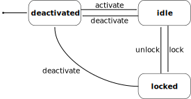

[index](../index.md)

---

# Qudi Measurement Modules
Qudi user applications revolve around "qudi measurement modules", namely hardware, logic and 
graphical user interface (GUI) modules.

> **⚠ WARNING:**
> 
> The term "module" is a bit misleading in this context since it usually refers to a `.py` file 
> containing one or multiple definitions and/or statements.  
> In our case a "qudi/measurement module" refers to a non-abstract subclass of `qudi.core.Base`
> (`LogicBase` and `GuiBase` are subclasses of `Base` as well) that is declared in a Python module 
> usually located at `qudi/[hardware|logic|gui]/` 
> (exception: [qudi extension](../404.md) directories).
> 
> Historical reasons... you know...

At the heart of each qudi measurement application stands a logic module. Logic modules 
are the "brains" of each application and are responsible for control, configuration, monitoring, 
data analysis and instrument orchestration to name only a few common tasks.

If an application requires hardware instrumentation you also need qudi hardware modules to provide 
abstracted hardware interfaces to logic modules. If you want to know more about hardware 
abstraction in qudi, please read the [hardware interface documentation](hardware_interface.md).

Having a logic module and possibly a hardware module is the bare minimum of a qudi measurement 
application. The logic module provides a set of methods and properties that can be considered an 
API for the specific measurement application, i.e. it provides full control over a certain type of 
measurement. You can now control the logic via an interactive IPython session, e.g. a jupyter 
notebook using the qudi kernel or the qudi manager GUI console.

While a logic module is in principle enough to control a measurement application, you may want to 
provide a more user-friendly interface. This is where qudi GUI modules come into play. 
Each qudi GUI module must assemble and show a Qt `QMainWindow` instance that can use everything 
[Qt for Python (PySide2)](https://doc.qt.io/qtforpython/) has to offer.  
They must connect to at least one logic module in order to provide a graphical interface for it. 

> **⚠ WARNING:**
> 
> GUI modules MUST NOT contain any "intelligent" code.  
> In other words they MUST NOT facilitate any 
> functionality that could not be achieved by using the bare logic module(s) it is connecting to.


## Module Features
All qudi measurement module classes are descendants of the abstract `qudi.core.module.Base` class
which provides the following features:

#### 1. Logging
Easy access to the qudi logging facility via their own logger object property `log`.  
It can be used with all major log levels:
```python
<module>.log.debug('debug message')        # ignored by logger unless running in debug mode
<module>.log.info('info message')
<module>.log.warn('warning message') 
<module>.log.error('error message')        # user prompt unless running in headless mode
<module>.log.critical('critical message')  # user prompt unless running in headless mode and 
                                           # qudi shutdown attempt
```

#### 2. Finite State Machine
A very simple finite state machine (FSM) that can be accessed via property `module_state`:  

  

The qudi [module manager](../404.md) uses this FSM to control and monitor qudi measurement modules.

It can also be accessed by other entities in order to check if the measurement module is in `idle` 
or `locked` state (i.e. if the module is busy).  
The name of the current state can be polled by calling the FSM object: `<module>.module_state()`.

#### 3. Thread Management
Logic modules (subclass of `qudi.core.module.LogicBase`) will run by default in their own thread. 
Hardware and GUI modules will not live in their own threads by default. This is why it is so 
important to facilitate [inter-module communication](../404.md) mainly with Qt Signals in order 
to automatically respect thread affinity.

You can access the Qt `QThread` object that represents the native thread of the module via the 
property `module_thread`.

To simply check if a module is running its own thread use the `bool` 
property `is_module_threaded`.  

To manually alter thread affinity, you can explicitly declare `_threaded` in the class body of your 
measurement module implementation to be `True` or `False` to let it run in its own thread or in 
the main thread, respectively, i.e.:
```python
from qudi.core.module import Base

class MyExampleModule(Base):
    """ Description goes here """
    
    _threaded = True  # or alternatively False
    ...
```
Spawning and joining threads is handled automatically by the qudi [thread manager](../404.md).

#### 4. Balloon and Pop-Up Messaging
An easy way to notify the user with a message independent of the logging facility is provided via 
the two utility methdos `_send_balloon_message` and `_send_pop_up_message`.

By providing a title and message string to these methods, the user will either see a balloon 
message (if supported by the OS) or a pop-up message with an OK button to dismiss, respectively.

For balloon messages you can additionally provide a timeout and a `QIcon` instance to customize
the display duration and appearance.  
Of course pop-up messages will not work if qudi is running in headless mode. In that case the 
message will be printed out. This is also the behaviour if balloon messages are not supported 
by the OS.

#### 5. Status Variables
Status variables (`qudi.core.module.StatusVar` members) are automatically dumped and loaded upon 
deactivation and activation of the measurement module, respectively.  

In case you want to manually issue a dump of status variables, a module can call 
`_dump_status_variables`.

> **⚠ WARNING:**
> 
> Please be aware that dumping status variables can potentially be slow depending on 
the type and size of the variables. So think carefully before using manual dumping.

See also the [qudi status variable documentation](../404.md).

#### 6. Static Configuration
Using qudi config options (`qudi.core.module.ConfigOption` members) one can facilitate static 
configuration of your measurement modules.  
Upon instantiation of a module, `ConfigOption` meta 
variables are automatically initialized from the corresponding part of the current qudi config.
> **⚠ WARNING:**
> 
> `ConfigOption` variables are only initialized once at the instantiation of the module and 
NOT each time the module is activated.

See also the [qudi configuration option documentation](../404.md).

#### 7. Measurement Module Interconnection
You can define other measurement modules that can be accessed via `Connector` meta object members.  
The qudi module manager will automatically load and activate dependency modules according to the 
configuration and connect them to the module upon activation.

See also the [section further below](#inter-module-communication) for more info.
    
#### 8. Meta Information
Various read-only properties providing meta-information about the module:

| property                  | description                                                                                     |
| ------------------------- | ----------------------------------------------------------------------------------------------- |
| `module_name`             | The name given to the module by the currently loaded qudi configuration                         |
| `module_base`             | The module base type identifier string (`'gui'`, `'logic'` or `'hardware'`)                     |
| `module_uuid`             | A unique `UUID` that can be used to identify the module unambiguously                           |
| `module_default_data_dir` | The full path to the default module data directory. Can be overridden by module implementation. |

#### 9. Access to qudi main instance
Each measurement module holds a (weak) reference to the [`qudi.core.application.Qudi`](../404.md) 
singleton instance. 
This object holds references to all running core facilities like the currently loaded 
`Configuration`, the `ModuleManager`, `ThreadManager` and the `rpyc` servers for remote module 
and IPython kernel functionality.

> **⚠ WARNING:**
> 
> Designing a measurement module that needs to access the qudi application singleton is 
generally considered bad practice. Unless you have a very specific and good reason to do so, 
you should never use this object in your experiment toolchains.


## Inter-Module Communication
So, as you might have noticed the relationship of GUI, logic and hardware modules is hierarchical:
- GUI modules control one or more logic modules but no other GUI or hardware modules
- Logic modules control other logic modules and/or hardware modules but no GUI modules
- Hardware modules control no other qudi modules and are just providing an interface to a specific 
instrument

The connection to another module is done by the `qudi.core.connector.Connector` meta object. These
connectors declare the dependency of a module on another module further down the hierarchy, i.e. it 
opens up a control flow path to another module.

See the [qudi connectors documentation](connectors.md) for more details on how connectors work.

Generally the control flow between modules should be signal-driven according to the 
[Qt signal-slot principle](https://doc.qt.io/qt-5/signalsandslots.html).  

In the case of qudi this means a module should connect its own Qt signals to slots 
(callback methods) in another module (unidirectional control flow) and connect signals from the 
other module with its own slots (bidirectional control flow).  
So, a modules can trigger the execution of a slot in another module. If both modules connected that 
way are not running in the same thread all this will automatically happen asynchronously.  
This is especially useful for GUI modules calling long-running logic methods/slots because they 
would otherwise lock up and be unresponsive until the logic method has returned.

A common example would be a GUI module triggering the start of a long-running logic method:
```python
from PySide2.QtCore import Signal
from qudi.core.module import Base, LogicBase
from qudi.core.connector import Connector

# GUI module declaration in e.g. qudi/gui/my_gui_module.py
class MyGuiModule(Base):
    """ Description goes here """
    
    # Qt signal triggering the start of the measurement
    sigStartMeasurement = Signal()  
    
    # Connector to get a reference to the measurement logic module
    _logic_connector = Connector(interface='MyLogicModule', name='my_logic')

    ...
    
    def on_activate(self):
        self.sigStartMeasurement.connect(self._logic_connector().start_measurement)
        self._logic_connector().sigMeasurementFinished.connect(self._measurement_finished)
        
    def trigger_measurement_start(self):
        """ Will just emit the sigStartMeasurement signal """
        self.sigStartMeasurement.emit()

    def _measurement_finished(self):
        """ Callback for measurement finished signal from logic module """
        print('Logic has finished the measurement')

    ...

# Logic module declaration in e.g. qudi/logic/my_logic_module.py
class MyLogicModule(LogicBase):
    """ Description goes here """
    
    # Qt signal notifying all connected "listeners" about a finished measurement
    sigMeasurementFinished = Signal()  

    ...
        
    def start_measurement(self):
        """ API method to start a measurement """
        # Actually perform your measurement here and emit notification signal upon finishing
        self.sigMeasurementFinished.emit()

    ...
```
In the above example, a GUI call to `trigger_measurement_start` will return immediately and cause 
the logic module to asynchronously start the measurement by running `start_measurement`.  
While the measurement is running in the logic thread, the GUI module stays responsive and can 
perform other tasks.  
As soon as the logic module has finished its measurement it will emit a signal causing all 
connected slots to be called asynchronously in their respective threads. In our case this will 
execute the `_measurement_finished` callback and print the message.

The same kind of control flow can be established between multiple logic modules, each running in 
its own thread.

There is an exception to this kind of control flow... hardware modules.  
Hardware modules usually just provide a set of wrapper methods to control an instrument and are 
typically controlled by logic modules that run in their own thread. So in most cases there is no 
need to access hardware functionality asynchronously and the logic can thus simply access the 
hardware directly via its connector (without signal/slot mechanics):
```python
from qudi.core.module import LogicBase
from qudi.core.connector import Connector


class MyLogicModule(LogicBase):
    """ Description goes here """
    
    # Connector to get a reference to the hardware module
    _hardware_connector = Connector(interface='MyHardwareInterface', name='my_hardware')

    ...
        
    def do_stuff_in_hardware(self):
        """ Will perform some task using the connected hardware """
        self._hardware_connector().do_stuff()  # direct method call, no signal/slot shenanigans

    ...
```


---

[index](../index.md)
