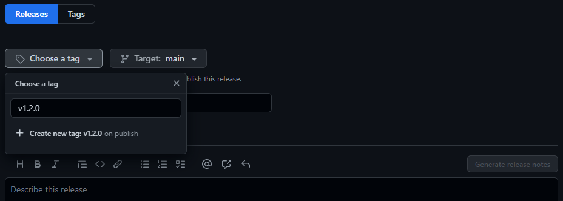
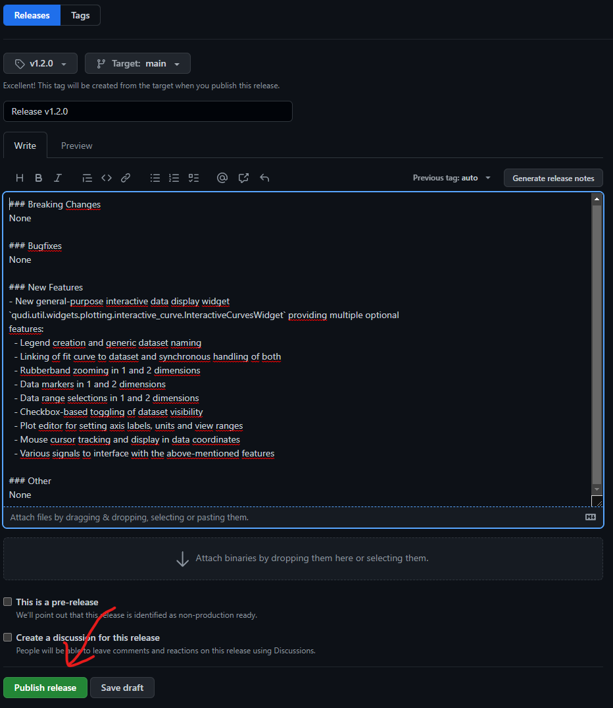

layout: default
title: qudi-core
---

[index](../index.md)

---

# How to create a new qudi-core release

## 1. Version bump

Create a single commit that includes three changes:
- Update version number in file `/Version`. The scheme is `Major.Minor.Hotfix`.
- Rename "Pre-Release" section in `/docs/changelog.md` to "Version x.y.z" and add release date 
below. Create new empty "Pre-Release" template (subsections) at the top of the file. 
The head of the file should look like this:
  ```
  # Changelog
  
  ## Pre-Release
  
  ### Breaking Changes
  None
  
  ### Bugfixes
  None
  
  ### New Features
  None
  
  ### Other
  None
  
  
  ## Version x.y.z
  Released on DD.MM.YYYY
  ...
  ```
- Add the version to be released to `/.github/ISSUE_TEMPLATE/bug_report.yml` under the body item 
with `id: version`. Insert the new release version as new item in the dropdown item just below 
`Development` and above the newest previous release version:
  ```
  name: Bug Report
  description: File a new bug report
  title: "[Bug] "
  labels: ["bug"]
  body:
    - type: markdown
      attributes:
        value: |
            Please fill out this bug report form as thorough as possible!
            Thank you for taking the time.
    - type: dropdown
      id: version
      attributes:
        label: Version
        description: What version of our software are you running?
        options:
          - Development
          - Release vX.Y.Z   <---------------------------------------------- HERE!!!
          - Release v1.1.0
          - Release v1.0.1
          - Release v1.0.0
      validations:
        required: true
    - type: textarea
    ...
  ```

Push these changes to `main` via release PR.

## 2. Wait for PyPI test release to be successful
Check the [GitHub Actions status](https://github.com/Ulm-IQO/qudi-core/actions) for a successful 
PyPI test server release. This is _not_ the actual PyPI release but just a test run to identify 
problems before the actual release.

**If this test run fails, you need to fix the issue before commencing with the release!**

  

## 3. Create new release with tag on GitHub
1. Go to https://github.com/Ulm-IQO/qudi-core/releases and click on "Draft a new release":
    
2. Create a new release tag with the naming convention according to the version number to be 
released `vX.Y.Z`. Click on `+ Create new tag: ... on publish` and make sure the Target is set to 
`main`.
  
3. Set name for the release to `Release vX.Y.Z` with respective version number inserted.
4. Copy over the section of `/docs/changelog.md` corresponding to the release and insert it in the 
release description field. Remove the section header, i.e. the `Version vX.Y.Z` part.
5. Now your release form should look like the screenshot below. If you are satisfied, click 
`Publish release` at the bottom of the form.
  

## 4. Wait for GitHub Actions to publish the release on PyPI
Congratulations! You have successfully published a release of `qudi-core` on GitHub and PyPI.
  
---

[index](../index.md)